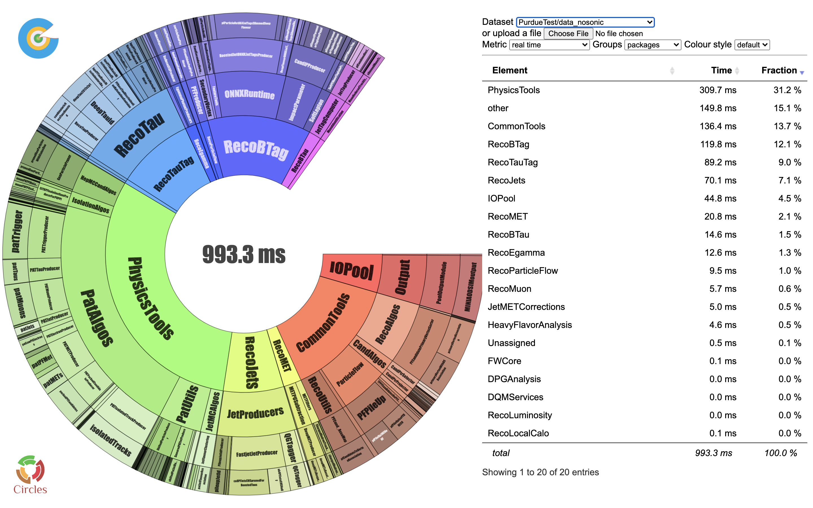

# Latency and Throughput Benchmark

### Perf Client

Model inference latency and throughputs can be benchmarked via Perf Client, documented in [Model Optimization](sonic-models/model-optimization.md) section.&#x20;

However, the results are usually measured with random or zero inputs; for models with variational input dimensions, perf client requires the dimension to be pre-defined. These could make the perf client results differ from the results in realistic inferences, which needs to be measured in more realistic workflows.&#x20;

### FastTimerService and ThroughputService

CMSSW offers the [FastTimerService](https://github.com/cms-sw/cmssw/blob/master/HLTrigger/Timer/plugins/FastTimerService.cc) and [ThroughputService](https://github.com/cms-sw/cmssw/blob/master/HLTrigger/Timer/plugins/ThroughputService.cc) to measure the latency per module and the throughputs of the whole workflow. To use these in your workflow, add the following snippets into your cmssw scripts, similar to the example [here](https://github.com/yongbinfeng/sonic-workflows/blob/PurdueTest/run.py#L113-L150).

```python
process.FastTimerService = cms.Service( "FastTimerService",
    dqmPath = cms.untracked.string( "DQM/TimerService" ),
    dqmModuleTimeRange = cms.untracked.double( 40.0 ),
    enableDQMbyPath = cms.untracked.bool( True ),
    writeJSONSummary = cms.untracked.bool( True ),
    dqmPathMemoryResolution = cms.untracked.double( 5000.0 ),
    enableDQM = cms.untracked.bool( True ),
    enableDQMbyModule = cms.untracked.bool( True ),
    dqmModuleMemoryRange = cms.untracked.double( 100000.0 ),
    dqmModuleMemoryResolution = cms.untracked.double( 500.0 ),
    dqmMemoryResolution = cms.untracked.double( 5000.0 ),
    enableDQMbyLumiSection = cms.untracked.bool( True ),
    dqmPathTimeResolution = cms.untracked.double( 0.5 ),
    printEventSummary = cms.untracked.bool( False ),
    dqmPathTimeRange = cms.untracked.double( 100.0 ),
    dqmTimeRange = cms.untracked.double( 2000.0 ),
    enableDQMTransitions = cms.untracked.bool( False ),
    dqmPathMemoryRange = cms.untracked.double( 1000000.0 ),
    dqmLumiSectionsRange = cms.untracked.uint32( 2500 ),
    enableDQMbyProcesses = cms.untracked.bool( True ),
    dqmMemoryRange = cms.untracked.double( 1000000.0 ),
    dqmTimeResolution = cms.untracked.double( 5.0 ),
    printRunSummary = cms.untracked.bool( False ),
    dqmModuleTimeResolution = cms.untracked.double( 0.2 ),
    printJobSummary = cms.untracked.bool( True ),
    jsonFileName = cms.untracked.string(  "time.json" )
)
```

and

```python
process.ThroughputService = cms.Service( "ThroughputService",
    dqmPath = cms.untracked.string( "HLT/Throughput" ),
    eventRange = cms.untracked.uint32( 10000 ),
    timeRange = cms.untracked.double( 60000.0 ),
    printEventSummary = cms.untracked.bool( True ),
    eventResolution = cms.untracked.uint32( 100 ),
    enableDQM = cms.untracked.bool( True ),
    dqmPathByProcesses = cms.untracked.bool( True ),
    timeResolution = cms.untracked.double( 5.828 )
)
```

`FastTimerService` will produce a json file saving the **CPU latency **of each module, and `ThroughputService` will print out the throughputs measured in a series of time intervals during processing.&#x20;

The output json file of `FastTimerService` can be visualized in Piechart table, for example, using the link [here](https://yofeng.web.cern.ch/yofeng/circles/web/piechart.php). The outputs are similar to the plot below:



**Note** that the latency measured by `FastTimerService` only includes the latency on the CPU side. **The processing time on the servers are not included**. So one could measure the latency of direct inference (without SONIC) and latency with SONIC. The difference between these two should be the expected improvements on throughput according to [Amdahl's law](https://en.wikipedia.org/wiki/Amdahl's\_law).

### Server-side metrics

The inference latency, queue time, GPU utilization, and memory utilization, etc on the server side are saved on the server. One would pull these metrics out by running e.g.:

```bash
curl localhost:8002/metrics
```

More information can be found [here](https://github.com/triton-inference-server/server/blob/main/docs/metrics.md). The outputs should be similar to the following:

```
# HELP nv_inference_request_success Number of successful inference requests, all batch sizes
# TYPE nv_inference_request_success counter
nv_inference_request_success{gpu_uuid="GPU-57cd6b41-5313-5467-653c-f2a699e9028f",model="deeptau_nosplit",version="1"} 0.000000
# HELP nv_inference_request_failure Number of failed inference requests, all batch sizes
# TYPE nv_inference_request_failure counter
nv_inference_request_failure{gpu_uuid="GPU-57cd6b41-5313-5467-653c-f2a699e9028f",model="deeptau_nosplit",version="1"} 0.000000
# HELP nv_inference_count Number of inferences performed
# TYPE nv_inference_count counter
nv_inference_count{gpu_uuid="GPU-57cd6b41-5313-5467-653c-f2a699e9028f",model="deeptau_nosplit",version="1"} 0.000000
# HELP nv_inference_exec_count Number of model executions performed
# TYPE nv_inference_exec_count counter
nv_inference_exec_count{model="deeptau_ensemble",version="1"} 0.000000
nv_inference_count{gpu_uuid="GPU-57cd6b41-5313-5467-653c-f2a699e9028f",model="deeptau_nosplit",version="1"} 0.000000
...
```

where one could calculate the inference request batch size by `Inference Count / Request Count` and the actual inference batch size (after dynamic batching) by `Inference Count/Execution Count`.&#x20;

The latency can also be compared between `Request Time` , `Queue Time` , `Compute Input Time`, `Compute Time`, and `Compute Output Time`. The `Request Time` is the total processing time on the server side and should be equal to the sum of the other four. Usually the compute input/output time and queue time are small, and `Compute Time` dominates the latency. If you notice sometimes the `Queue Time` dominates the latency, it probably means your server is over-saturated.&#x20;
